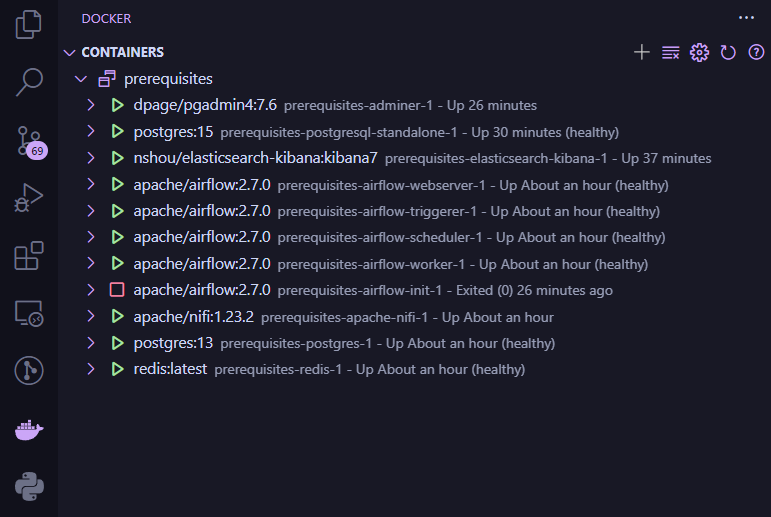

# Необходимый минимум для выполнения лабораторных работ

## Требования

Все, что необходимо для выполнения лабораторных работ по курсу "Инженерия данных".

Для его использования необходимо иметь установленный [**docker**](https://www.docker.com/)

Также рекомендуется к установке среда [**vscode**](https://code.visualstudio.com/),
со следующими расширениями:

* [ms-python.python](https://marketplace.visualstudio.com/items?itemName=ms-python.python)
* [ms-toolsai.jupyter](https://marketplace.visualstudio.com/items?itemName=ms-toolsai.jupyter)
* [ms-vscode-remote.vscode-remote-extensionpack](https://marketplace.visualstudio.com/items?itemName=ms-vscode-remote.vscode-remote-extensionpack)
* [ms-azuretools.vscode-docker](https://marketplace.visualstudio.com/items?itemName=ms-azuretools.vscode-docker)

Для быстрой настройки среды можно воспользоваться следующим профилем:
[Python Jupyter Remote Docker.code-profile](./Python%20Jupyter%20Remote%20Docker.code-profile)
В него включен как набор необходимых расширений, так и ряд косметических и [QOL](## "Quality of life") изменений.

## Порядок запуска

1. Склонировать себе настоящий репозиторий

    ```bash
    git clone git@github.com:ssau-data-engineering/prerequisites.git
    cd .\prerequisites\
    ```

2. Выполнить следующую команду, подготавливающую к запуску **Apache airflow**

    ```bash
    docker compose up airflow-init
    ```

3. Выполнить следующую команду, запускающую все необходимые контейнеры.

    ```bash
    docker compose up --build -d
    ```

4. В результате должны быть запущены все контейнеры.

    

## Перечень сервисов с их адресами

* pgAdmin: <http://localhost:18081/>  (`pgadmin4@pgadmin.org`@`admin`)
* Kibana: <http://localhost:15601/>
* Apache Airflow: <http://localhost:8080/> (`airflow`@`airflow`)
* Apache Nifi: <http://localhost:18080/>

## Знакомство с инструментами

В рамках настоящего репозитория [*предлагается познакомиться*](https://github.com/ssau-data-engineering/Prerequisites/wiki) с основными инструментами, которые будут использоваться
в ходе выполнения лабораторных работ.
